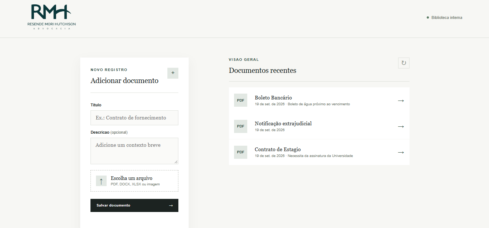
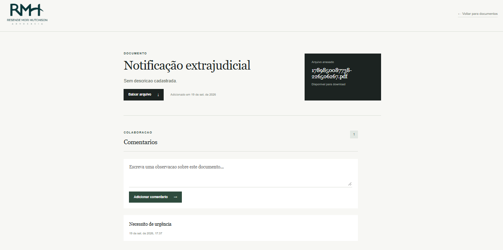

# Gestão de Documentos

Aplicação web simples para gestão de documentos, desenvolvida como prova técnica do processo seletivo de Estágio Desenvolvedor Full Stack da **RMH Advocacia (Resende Mori Hutchison)**.

A aplicação permite fazer upload de documentos (PDF, JPG ou PNG), visualizar a lista de documentos cadastrados, baixar/visualizar cada arquivo e manter um histórico de comentários vinculado a cada documento.

## Descrição do projeto

O sistema é dividido em duas partes:

- **Backend**: API REST responsável por receber os uploads, persistir as informações no banco de dados e servir os arquivos armazenados.
- **Frontend**: interface web simples (HTML, CSS e JavaScript puro) que consome a API para exibir a listagem de documentos, permitir o upload e gerenciar os comentários.

Cada documento possui um título, uma descrição opcional, a data de upload e um arquivo anexado. Cada documento pode receber múltiplos comentários, cada um registrado com data e hora automáticas.

## Capturas de tela

### Página inicial


### Detalhes do documento


## Tecnologias utilizadas

**Backend**
- [Node.js](https://nodejs.org/)
- [NestJS](https://nestjs.com/) — framework para estruturação da API
- [Prisma ORM](https://www.prisma.io/) — camada de acesso ao banco de dados
- [SQLite](https://www.sqlite.org/) — banco de dados (armazenado em arquivo local)
- [Multer](https://github.com/expressjs/multer) — middleware para upload de arquivos

**Frontend**
- HTML5
- CSS3
- JavaScript (puro, sem frameworks)

**Ferramentas**
- Git e GitHub para versionamento

## Estrutura do projeto

```
Gestao_Documentos/
├── backend/          # API NestJS + Prisma
│   ├── prisma/       # schema do banco e migrações
│   ├── src/
│   │   ├── document/ # módulo de documentos (upload, listagem, download)
│   │   ├── comment/  # módulo de comentários
│   │   └── prisma/   # serviço de conexão com o banco
│   └── uploads/      # arquivos enviados pelos usuários
└── FrontEnd/         # interface web (HTML, CSS, JS)
    ├── index.html    # listagem e upload de documentos
    ├── document.html # detalhes do documento e comentários
    ├── css/
    └── js/
```

## Instruções para execução local

### Pré-requisitos

- [Node.js](https://nodejs.org/) instalado (versão 18 ou superior)
- Um navegador web
- (Opcional) Extensão **Live Server** no VS Code, para servir o frontend

### 1. Clonar o repositório

```bash
git clone https://github.com/LuisMoura18/Gestao_Documentos.git
cd Gestao_Documentos
```

### 2. Configurar e rodar o backend

```bash
cd backend
npm install
```

Crie um arquivo `.env` na raiz do `backend` (caso não exista) com o seguinte conteúdo:

```
DATABASE_URL="file:./dev.db"
```

Gere o banco de dados e o Prisma Client:

```bash
npx prisma generate
npx prisma migrate dev
```

Inicie o servidor:

```bash
npm run start:dev
```

O backend estará disponível em `http://localhost:3000`.

### 3. Rodar o frontend

Com o backend em execução, abra o arquivo `FrontEnd/index.html`:

- **Opção recomendada**: usando a extensão Live Server do VS Code, clique com o botão direito sobre `index.html` e selecione **"Open with Live Server"**.
- **Alternativa**: abra o arquivo diretamente no navegador (duplo clique).

A aplicação já está configurada para se comunicar com a API em `http://localhost:3000`.

## Principais rotas da API

| Método | Rota                                | Descrição                                  |
|--------|--------------------------------------|---------------------------------------------|
| POST   | `/documents`                        | Cria um novo documento (upload de arquivo)  |
| GET    | `/documents`                        | Lista todos os documentos                   |
| GET    | `/documents/:id`                    | Retorna os dados de um documento específico |
| GET    | `/documents/:id/download`           | Faz o download/visualização do arquivo      |
| POST   | `/documents/:documentId/comments`   | Adiciona um comentário a um documento       |
| GET    | `/documents/:documentId/comments`   | Lista os comentários de um documento        |

## Observações e limitações conhecidas

- Não há implementação de autenticação, login ou controle de acesso, conforme especificado no escopo da prova técnica.
- Os arquivos enviados são armazenados localmente no servidor (pasta `uploads/`), e as informações são persistidas em um banco SQLite (`dev.db`).
- No ambiente de deploy, dependendo do provedor utilizado, o armazenamento de arquivos pode não ser persistente entre reinicializações do servidor (limitação comum em planos gratuitos de hospedagem). Recomenda-se testar novos uploads diretamente no ambiente publicado.
- O frontend foi desenvolvido com HTML, CSS e JavaScript puro, sem uso de frameworks, conforme os requisitos técnicos da prova.

## Link do deploy
 
> URL do backend publicado: ``

---

Desenvolvido para o processo seletivo de Estágio Desenvolvedor Full Stack — RMH Advocacia.